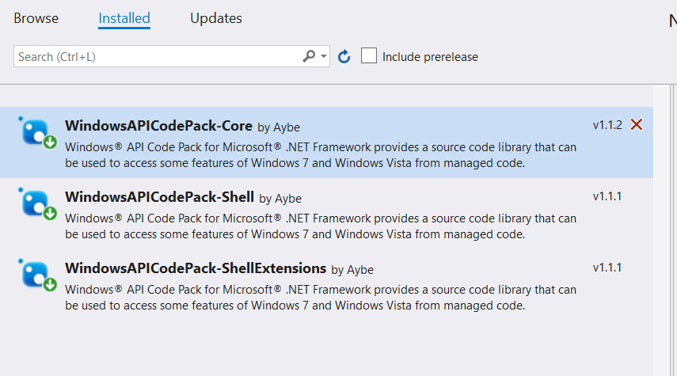
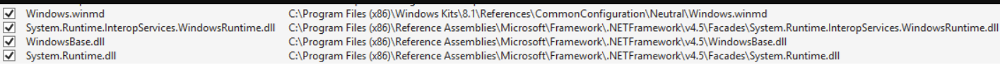
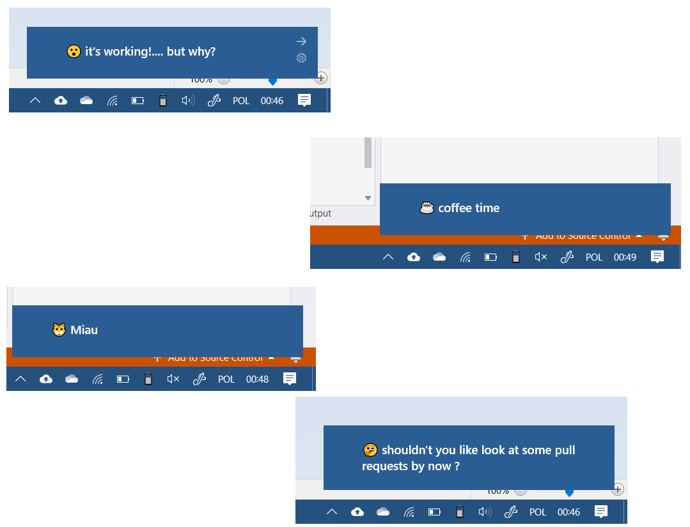
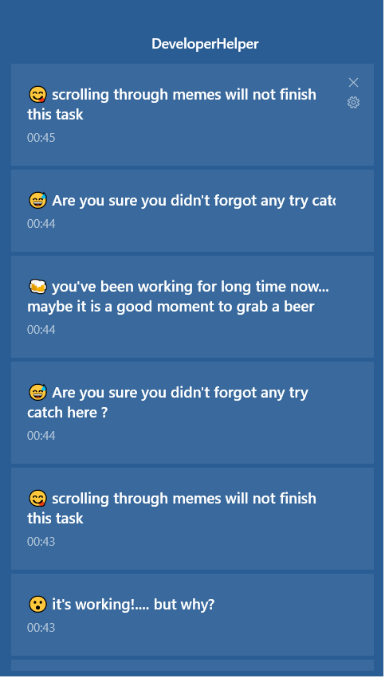

## Developer helper
---
### 🎯 Aim 
The aim was to develop some simple app in 16 lines of code to suppor the [#code16challenge](https://www.facebook.com/hashtag/code16challenge) facebook event

---
### 🙄 What was done
I added a console app which every couple of minutes presents a random push notification message. The sleep time and the messages may be changed in the App.config file

---
### 🚀 How to run
1. clone
2. I guess you will need to restore nugets 

3. I suppose you will need to fix reverences to windows dll's

4. run 👍

---
### 📸 Result
some notifications that show from time to time

notifications summary
